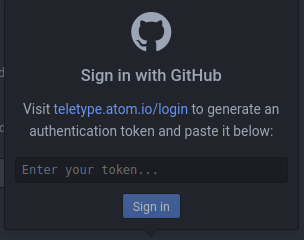
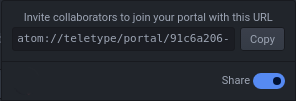
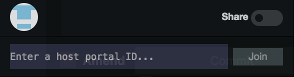

.. _teletype-basics:

***************
Teletype Basics
***************

What is Teletype?
=================

**An Atom feature that allows people to collaborate on the same file at the same time.**

Why Teletype instead of Google Docs?
------------------------------------

**Teletype supports code and gives you more control over file collaborators.**

Setting up Teletype
===================

Click on the Teletype icon (a radio tower) in the bottom right. You should see this window:

When you use Teletype for the first time, you'll need to give it access to your Github account:

#. Open the `teletype.atom.io/login <https://teletype.atom.io/login>`_ link. Log in to
   Github if you haven't already.
#. Click "Copy token", paste it in Teletype, then click "Sign in".

Using Teletype
==============

To collaborate on files, one person has to *host a portal*, then others can
*join the portal* to collaborate.

Hosting a Portal
----------------

1. In Teletype, click on the "Share" switch. You should see this window:

2. *Copy* the URL and message it to your collaborators.

As the host, your collaborators can't see your Project pane or the files in it when they join your portal. You have to *open* each file that you want to collaborate on. Also, **don't close Atom or put your computer to sleep** - doing so will kick your collaborators off the portal!

Joining a Portal
----------------

1. In Teletype, click on "Join a portal". You should see this window:

2. Copy the URL that your host shared, paste it in Teletype, then click
"Join".

As a guest, you'll need your host to open any files that you want to edit.

Much like with Google Docs, you'll see differently colored cursors for each person that you're working with. Clicking on their icon in the bottom right will let you jump to whatever they're working on.

**Now, feel free to try out Teletype with someone else on the**
``Interactive-Tutorial-1-Markdown.md`` **file in your** ``aguaclara_tutorial``
**repository.**

**Congratulations, you've finished the Atom and Markdown section! You can now
move on to the Python and Hydrogen section by clicking "Next" at the bottom of
the page.**
