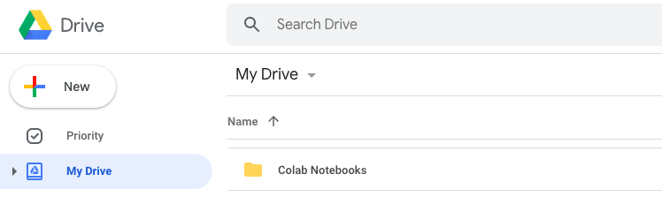
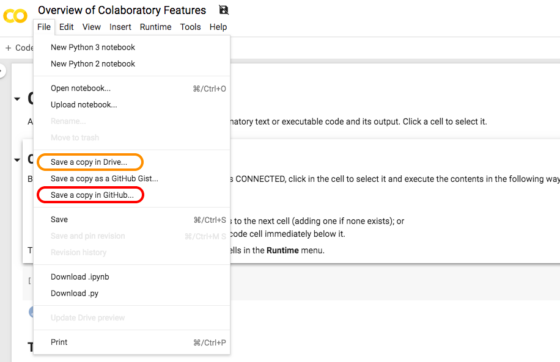

.. _colab-introduction:

Google Colaboratory Introduction
================================

.. image:: https://colab.research.google.com/img/colab_favicon.ico
    :align: center

`Google Colaboratory, or Colab <https://colab.research.google.com>`_, is a
cloud-based environment for writing documents with live code, visualizations,
and narrative text. For those who are familiar with Jupyter notebooks,
Colab notebooks are the same, including the .ipynb extension. Unlike
Jupyter and Atom (our previous editor for code and reports), however, Colab
requires no setup on your computer! It also provides a large amount of free
computing power and easy document sharing.

Colab Notebooks
^^^^^^^^^^^^^^^
A Colab notebook consists of **text cells**, **code cells**, and **outputs of
code cells**.

1. Text cells are written in **Markdown**, a markup language we'll learn about in the next section. This means they can contain formatted text, images, HTML, LaTeX, and more.

2. Code cells are written in Python. We can also insert a system/terminal command by prefixing a line with !, like so:

   .. code-block:: python

     print("This is Python code.")
     !echo This is a system command.

3. Outputs of code cells appear below their corresponding cell. They can include text, graphics, and information about errors that occurred while executing the code.

For a more in-depth explanation of a Colab notebook and an example, see the
first 3 sections of Google Colab's `Overview of Colaboratory Features
<https://colab.research.google.com/notebooks/basic_features_overview.ipynb>`_.

.. image:: images/Overview-of-Colab.png
    :align: center
    :target: https://colab.research.google.com/notebooks/basic_features_overview.ipynb
    :width: 700

Saving Notebooks
^^^^^^^^^^^^^^^^
Any notebook created through Colab is automatically saved to your Google Drive.
You'll find it in a golden colored folder named Colab Notebooks.

If you open a notebook that you do not have permission to edit, you can save an
editable copy to your Google Drive by clicking **File > Save a copy to Drive...**.
For any notebook, you can also save it in an already existing Github repository
by clicking **File > Save a copy in Github...**.

Completing the AguaClara Tutorial in Colab
^^^^^^^^^^^^^^^^^^^^^^^^^^^^^^^^^^^^^^^^^^
To complete the AguaClara Tutorial assignment, you will need to open several
Colab notebooks from the `aguaclara_tutorial Github repository
<https://github.com/AguaClara/aguaclara_tutorial>`_. They are also linked below:

* `Interactive Tutorial 1: Markdown <https://colab.research.google.com/drive/15yYapOXlOLOEYMttz8v1Vb5odRkkJdhO>`_
* `Interactive Tutorial 2: Python Basics <>`_
* `Interactive Tutorial 3: Python Packages <>`_

After opening an interactive tutorial in Colab,

1. Save a copy of the notebook to your Drive and prefix the file name with your netID.

   * For example, ``Interactive-Tutorial-1-Markdown.ipynb`` becomes ``netID-Interactive-Tutorial-1-Markdown.ipynb``

2. Follow the instructions in the notebook, using the next sections of this tutorial wiki to guide you.

3. Click the "Share" icon in the top left corner of the page and get a shareable link for your Colab notebook.

4. Email links for all of your finished interactive tutorial to aguaclara@cornell.edu.
