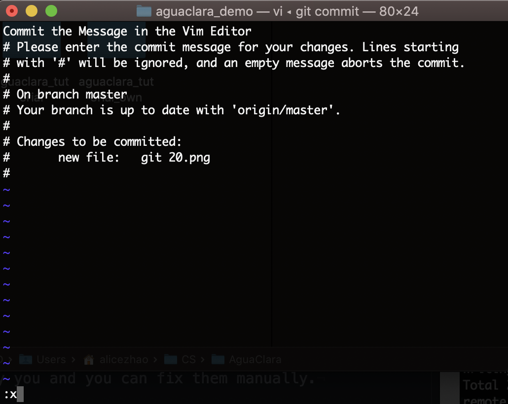

.. _git-in-the-command-line:

***********************
Git in the Command Line
***********************

What is Git?
============

Git is a free and open source control system used for managing projects on Github. It offers many more commands and much more flexibility than Github's online interface does.

**Note:** This tutorial assumes some knowledge of the basic commands of Github.  To refresh on those, refer to :ref:`github-basics`.

Installing Git
==============

To install Git, follow the instructions on `this page <https://git-scm.com/book/en/v2/Getting-Started-Installing-Git>`_.  For Windows, when installing Git through the installer, it is recommended you select the "Use Git from the Windows Command Prompt" option.  This will allow you to use all git commands through your terminal (CMD, PowerShell, Anaconda) rather than having to use Git's personal terminal, Git Bash.

Using the Command Line
======================

If you are already familiar with using the command prompt, feel free to skip this section.

The command prompt/terminal is another way of interfacing with your computer, rather than the way you typically would use a computer by clicking different buttons.  While the terminal can be confusing at first, and requires some memorization of some commands, it provides a lot of power for using your computer in different ways.  Knowing how to use the terminal opens a lot of new doors and can ultimately make using your computer much easier and more accessible.

Note that there are a few terminal options for Windows, such as CMD, Windows PowerShell, and the Anaconda Prompt.  This tutorial will use PowerShell, as it is most similar to the Mac terminal, and has all the necessary functionality.  However, all the other terminal options should accomplish everything you want, just with slightly different commands.

To open your terminal in Windows, search for "PowerShell" in your programs.  On Mac, just search for "Terminal" in your programs.  A prompt like the one below should open up.

.. image:: images/git2.png

Within this prompt, you will run commands by typing them directly into this prompt and hitting "Enter".  The path listed before the where you type is the directory you are currently working in on your computer.  In order to run commands on a specific folder (such as your subteams repository) you will need to navigate to that folder.  The two commands to do this are:

* ``ls`` (list): Lists all files in the current directory you are in
* ``cd`` (change directory): changes your directory to the directory listed after cd

For example, say I want to move to the "aguaclara_demo" repository to make some git changes.  First I use ``ls`` to see what files I can change to:

.. image:: images/git3.png

I see the CS folder, so I use ``cd CS`` to move to that folder.  From there I continue to use these commands until I find the folder I am looking for.

If you ever need to move up one folder, you can use ``cd ..`` to accomplish this.  If you know the file path of the folder you want, you can also add that directly to move to your desired folder.  For example, I could move directly to the aguaclara_demo folder as shown below:

.. image:: images/git4.png

One other important note for using the terminal is to always wait for the commands to finish running.  Sometimes when running a more complicated command, the computer will take a while to run, and the terminal will slowly show commands as they run.  In this case, make sure to wait until all the commands are done running, and you can see the blinking cursor before you type another command.  If you ever want to stop a command while it's running, hold down the control button (or the command button on Mac) and hit "c".

Using Git in the command line
=============================

Cloning a Repository
--------------------

To clone a repository from GitHub to your local computer, you can use the command line to accomplish this task. Let's all clone the aguaclara_tutorial repository so that you get the hang of it. First go to the `repository <https://github.com/AguaClara/aguaclara_tutorial>`_ and click on the green ``Clone or Download`` button. Copy the URL shown.

Then, navigate to your command line. Go to the folder you would like your repository to be stored on your local computer. Then, type in ``git clone <INSERT URL>``. Wait until the command line finishes cloning the repository. Then you're done!

Assuming you added Git to your command line during installation, you can run any Git command from the command line just by typing ``git`` adding a space, and writing the command.  For example, to use the simple command ``git status``\ , which compares your local progress to the digital collection of Github, just type "git status" while in the folder you want to check.

.. image:: images/git5.png

Pulling
-------

Most of what you will be doing with Git is pulling and pushing changes from Github.  To pull, just use the command ``git pull``.

Pushing
-------

To push your local changes, first stage your changes, then commit them to your branch, and then push them to the origin.

* To stage your changes, use ``git add -A`` The -A ensures you add all of your files you have worked on.

.. image:: images/git7.png

* To commit your changes, use the command ``git commit -m "Commit Message"`` and fill in the commit message with whatever you want to say about your commit.  Note that it is very important to include the -m and the commit message.  If you do not, Git will take you to an interface using the text editor Vim, which is very challenging to use.

.. image:: images/git8.png

* If you happen to accidentally type ``git commit`` without the -m and the commit message and get taken to Vim, you can still write your commit message. Use your arrow keys to scroll up to the top line where it is blank. Write your commit message, then to exit out of this editor, press Escape. You cursor should appear in the bottom left corner. From there type ``:x`` and hit enter to save your commit message.

* Finally, to push your changes, use ``git push``.  If you have any merge errors, the terminal will notify you and you can fix them manually.

.. image:: images/git9.png

.. TODO: include an image of a merge conflict resolution here

**Note:** This tutorial only covers the basics of using Git.  For the full list of commands, `view the full documentation here <https://git-scm.com/doc>`_.
