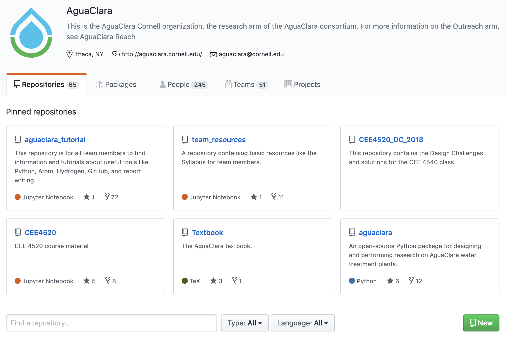
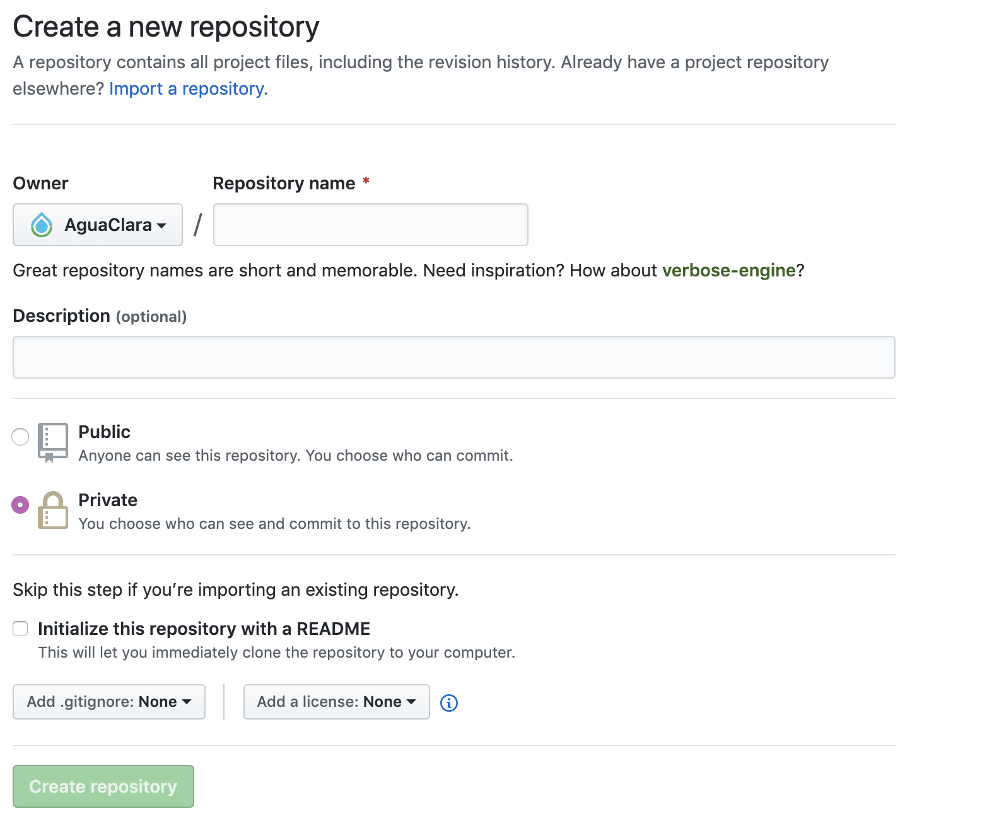
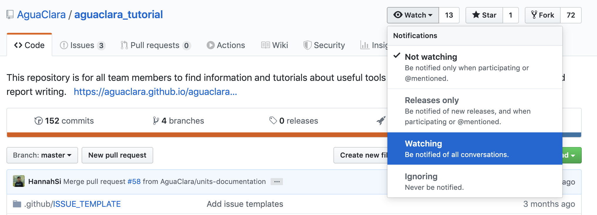
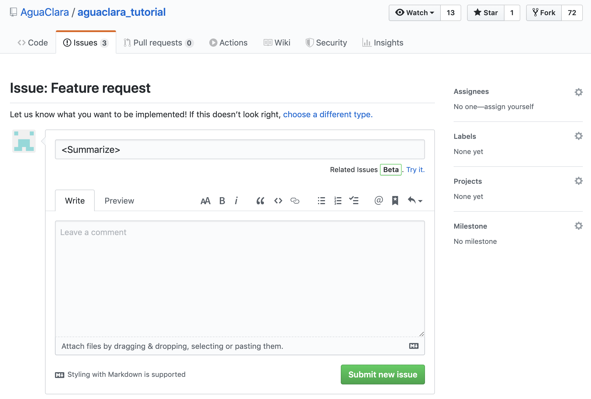
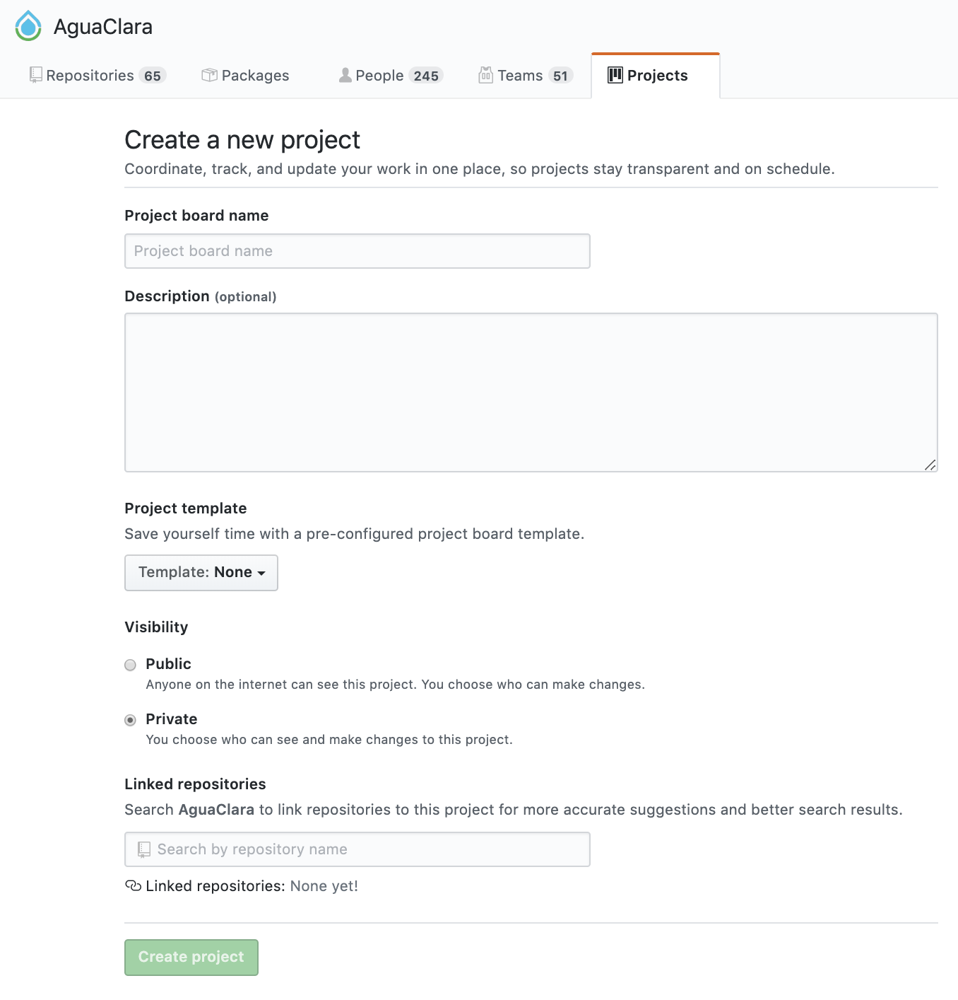

.. _github-basics:

*************
GitHub Basics
*************

Updating Your Profile
=====================

When you log in to GitHub, click on the icon in the top right. There should be a dropdown which has "Your profile" as one of the first options. Click there and then you'll be able to modify your profile settings. Please fill in your real name so that we will be able to quickly recognize who we're assigning issues to. After that feel free to change your settings however you'd like. Make sure to click the green update profile button at the bottom so the changes are saved.

Repositories
============

Creating a Repository
---------------------

Creating a repository is simple. We'll do this through the `GitHub Website <https://www.github.com>`_. First go to the `AguaClara Team Page <https://github.com/AguaClara>`_.

Now click on the green ``New`` button, and this will direct you to a repository creation page. Each subteam lead should create a repository with the name of their subteam. Put in a description of what your subteam does and check the create a README box. Now go ahead and click the green ``Create repository`` button.

Cloning a Repository
--------------------

Go here :ref:`git-in-the-command-line` to learn how to clone a repository to your local computer.

Watching a Repository
---------------------

When you create or join a repository, you'll want to watch it. This means that every time someone posts an issue, you'll be notified of what they said. To make sure you get these notifications, you'll want to make sure you receive email notifications in your profile settings. To watch a repository, simply click the eyeball button at the top of your repository as shown below.

Creating an Issue
=================

Creating an issue is very simple. Just go to the ``Issues`` section on the top bar and then click ``New issue``. Let's call the first issue for each subteam "Update the wiki". You should put a good enough description of the issue so that anyone could read it and begin working on the problem. Attaching images can help explain the issue better. You can also assign people to the issue and add it to a project (more on that later) on the right side.

Creating a Project
==================

First go to the ``Projects`` section of the top bar, then click ``Create a project``. Now name your project and add a description. You can change the project template through the dropdown, but for the task map we'll use the blank template.

You can edit the columns to have whatever organization you'd like, but if you're not sure what would work best we'd suggest trying the example above. Once the columns are created, just click ``+ Add cards`` to search through the issues associated with your subteam's repository and add them to the project board.
