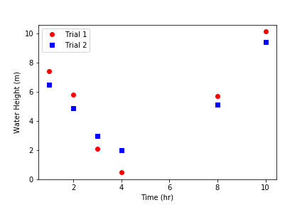

.. _data-analysis:

***********************
Data Analysis in Python
***********************

You may be familiar with viewing, graphing, and performing calculations on your data in Excel, MATLAB, or R. We'll show you in this tutorial that Python can be just as useful for data analysis!

.. We'll be taking advantage of the Python libraries `Matplotlib <https://matplotlib.org/api/_as_gen/matplotlib.pyplot.html>`_, `NumPy <https://docs.scipy.org/doc/numpy/reference/>`_, `Pandas <https://pandas.pydata.org/pandas-docs/stable/reference/index.html>`_, and `SciPy <https://docs.scipy.org/doc/scipy/reference/>`_ and our own `AguaClara package <https://aguaclara.github.io/aguaclara/>`_.
.. To learn more about the functions and modules available in each package, explore the documentation links above.

Running Calculations on Sets of Data
====================================
Given a Python list of values and a calculation you need to perform on each value, your instinct might be to write a loop that runs the calculation for each value. After all, Python can't run calculations on every element in a list at once, called *element-wise operations*, using basic operators:

.. code-block:: python

  x = [1, 2, 3, 4, 5]
  x/2

  TypeError: unsupported operand type(s) for /: 'list' and 'int'

However, there are other data types that can do this! We'll focus on the **NumPy array**. If our data is stored as a NumPy array, we can use the usual ``+``, ``-``, ``*``, ``/``, ``%``, and ``**`` operators to add (or subtract, etc.) each value in the array with either one constant value or values in another NumPy array (this array must be of the same dimensions).

Here is an example that calculates repeats a hypotenuse calculation for 5 triangles. We can use ``np.array()`` to convert Python lists to NumPy arrays.

.. code-block:: python

  import numpy as np

  a = np.array([1, 3, 5, 7, 9])
  b = np.array([0, 4, 12, 24, 40])
  c = np.sqrt(a ** 2 + b ** 2)
  c

  array([ 1.,  5., 13., 25., 41.])

.. >>> import numpy as np
.. >>> a = np.array([1, 3, 5, 7, 9])
.. >>> b = np.array([0, 4, 12, 24, 40])
.. >>> a ** 2
.. array([ 1,  9, 25, 49, 81])
.. >>> b ** 2
.. array([   0,   16,  144,  576, 1600])
.. >>> a ** 2 + b ** 2
.. array([   1,   25,  169,  625, 1681])
.. >>> c = np.sqrt(a ** 2 + b ** 2)
.. >>> c
.. array([ 1.,  5., 13., 25., 41.])

Note that NumPy is also built so that many of its mathematical functions, such as ``np.sqrt()`` above, can perform scalar (number to number) or element-wise (array to array) operations.

Reading Data Files with Pandas
==============================
LEFT OFF HERE

Plotting with Matplotlib
========================
`Matplotlib <https://matplotlib.org/api/_as_gen/matplotlib.pyplot.html>`_ is a popular library for plotting in Python. Most of what you’ll need is in the collection of functions called ``matplotlib.pyplot``, which we’ll abbreviate to ``plt`` here on.

Plt.plot()
^^^^^^^^^^
To graph a set of data, we can simply use the function ``plt.plot(x,y)``, where ``x`` and ``y`` are replaced with our sets of x- and y-coordinates, respectively. These sets can be Python lists, NumPy arrays, or Pandas series (we'll discuss the last two later).
For example,

.. code-block:: python

  import matplotlib.pyplot as plt

  hour = [1, 2, 3, 4, 8, 10]
  water_height = [7.4, 5.8, 2.1, 0.5, 5.7, 10.1]

  plt.plot(hour, water_height)

outputs the following graph:

.. image:: Images/Data_Analysis/basic.png
    :align: center

Figure Formatting
^^^^^^^^^^^^^^^^^
Of course, there are several issues with this graph. For one, discrete data should plotted with data symbols, not a line. Also, both axes should be labeled, and these labels should include units when appropriate.
(For more guidelines, see the Figure Requirements section of the `Report Template <https://github.com/AguaClara/team_resources/blob/master/Report_Template.md>`_.) Fortunately, Matlotlib contains many features for the formatting we need.

- **Line and marker style**: These can be specified as additional inputs to the ``plt.plot()`` function. For example, ``plt.plot(hour, water_height, 'ro')`` would plot our previous graph with red (r) circular (o) markers and no connecting lines.
  For more line specification options, visit the ``plt.plot()`` `documentation page <https://matplotlib.org/3.1.1/api/_as_gen/matplotlib.pyplot.plot.html>`_.
- **Axis labels**: Use ``plt.xlabel("...")`` and ``plt.ylabel("...")`` for your x- and y-axis labels, respectively.
- **Grid lines**: Use ``plt.grid("major")`` for major grid lines or ``plt.grid("minor")`` for minor grid lines.
- **Manual axis ranges**: ``plt.plot()`` will automatically scale the graph to your data, but you can alter axis ranges manually with ``plt.xlim(left, right)`` and ``plt.ylim(bottom, top)``.

Here is an improvement of the above graph, along with its code:

.. code-block:: python

    import matplotlib.pyplot as plt

    hour = [1, 2, 3, 4, 8, 10]
    water_height = [7.4, 5.8, 2.1, 0.5, 5.7, 10.1]

    plt.plot(hour, water_height, "ro")
    plt.xlabel("Time (hr)")
    plt.ylabel("Water Height (m)")

.. image:: Images/Data_Analysis/formatted.png
    :align: center

Multiple Plots
^^^^^^^^^^^^^^
To plot multiple sets of data, we can just call ``plt.plot()`` multiple times, perhaps with different line or marker styles to distinguish plots. Adding a legend and plotting with two y-axes, however, takes a few more steps.

Adding a legend
~~~~~~~~~~~~~~~
We can use ``plt.legend()`` with the inputs ``plt.legend(labels)`` or ``plt.legend(handles, labels)``.

1. **Labels only**: Labels for data sets must be given as a tuple of strings. Matplotlib automatically labels data sets in the order in which they were plotted. Below is an example:

.. code-block:: python

    import matplotlib.pyplot as plt

    hour = [1, 2, 3, 4, 8, 10]
    trial1 = [7.4, 5.8, 2.1, 0.5, 5.7, 10.1]
    trial2 = [6.5, 5.5, 3, 2, 5.1, 9.4]

    plt.plot(hour, trial1, "ro")
    plt.plot(hour, trial2, "bs")
    plt.xlabel("Time (hr)")
    plt.ylabel("Water Height (m)")
    plt.legend(("Trial 1", "Trial 2"))

2. **Handles and labels**: To have full control over which plots receive which labels, we can use line handles output by ``plt.plot()``. Along with creating a plot, the function outputs a tuple of objects representing the plotted data. The line handle we need is the *first* object in the tuple, so we can assign the handle to a variable by unpacking the tuple and ignoring every object after the first. We do this by assigning the output of ``plt.plot()`` to a variable followed by a comma and nothing else.

   Then, we input our line handles and line labels as two tuples to ``plt.legend()``, so that the data represented by the first handle gets the first label; the second handle, the second label; etc.

.. code-block:: python

    # ... same as previous code block
    line1, = plt.plot(hour, trial1, "ro")
    line2, = plt.plot(hour, trial2, "bs")
    # ...
    plt.legend((line1, line2), ("Trial 1", "Trial 2"))

The graph output by this code is the same as before.

Plotting with Two Y-Axes
~~~~~~~~~~~~~~~~~~~~~~~~
To plot multiple data sets on the same x-axes but different y-axes, first use ``plt.subplots()`` to get an axis handle for the first (left) y-axis. The axis handle is the second output of ``plt.subplots()``, so in order to access it we need to also access the first output, which we'll store as ``fig``.

.. code-block:: python

    fig, ax1 = plt.subplots()

From the axis handle for the first y-axis, create a second that shares the same x-axis using ``twinx()``:

.. code-block:: python

    ax2 = ax1.twinx()

Instead of ``plt.plot()``, ``plt.xlabel()``, ``plt.ylabel()``, ``plt.xlim()``, and ``plt.ylim()`` we must now call ``plot()``, ``set_xlabel``, ``set_ylabel``, ``set_xlim``, or ``set_ylim`` on a specific axis. Here is an example:

.. code-block:: python

    import matplotlib.pyplot as plt
    import numpy as np

    t = np.arange(0, 10, 0.1)
    x = t ** 3 - t ** 2 + t
    v = 3*t**2 - 2*t + 1

    fig, ax1 = plt.subplots()
    line1, = ax1.plot(t, x, "b")
    ax1.set_xlabel("Time (seconds)")
    ax1.set_ylabel("Displacement (m)")

    ax2 = ax1.twinx()
    line2, = ax2.plot(t, v, "g")
    ax2.set_ylabel("Velocity (m/s)")

    plt.legend((line1, line2), ("Displacement", "Velocity"))

.. image:: Images/Data_Analysis/two_y_axes.png
    :align: center

Other Matplotlib Features
^^^^^^^^^^^^^^^^^^^^^^^^^
Here are some other useful functions in ``plt``. For more details and features, check out the `Matplotlib Pyplot API <https://matplotlib.org/api/_as_gen/matplotlib.pyplot.html>`_.

* ``plt.savefig(“/path/to/folder/figure_name.png”)``: include this after plotting your data to save the generated figure as an image. Replace ``/path/to/folder/`` with your desired directory and ``figure_name.png`` with your desired figure name (other image extensions, just as .jpeg, work as well).
* ``plt.loglog(x, y)`` plots ``x`` and ``y`` on logarithmic scales.
* ``plt.semilogx(x, y)`` plots ``x`` on a log scale and ``y`` on a linear scale.
* ``plt.semilogy(x, y)`` plots ``x`` on a linear scale and ``y`` on a log scale.
* ``plt.text(x, y, text)`` writes text on the figure at the coordinate (``x``, ``y``) according to your axis scales.

Reading ProCoDA Data with the AguaClara Package
===============================================
The `AguaClara package <https://aguaclara.github.io/aguaclara/>`_ is a publicly available Python package written by AguaClara members to assist research subteams with scientific calculations, experimental design, and data analysis.

The ``aguaclara.research.procoda_parser`` module in the AguaClara  package contains functions for analyzing ProCoDA datalogs. Click `here <https://aguaclara.github.io/aguaclara/research/procoda_parser.html>`_ to see all its functions.

Example 1: Reading one column of data for a specified TIME
----------------------------------------------------------
The function

.. code-block:: python

  get_data_by_time(path, columns, dates,
                   start_time="00:00", end_time="23:59")

in the `procoda_parser` module extracts data from a ProCoDA datalog based on the `path` (folder in your computer) the file is located in, the `columns` you wish to extract, the `dates` of the experiment (a single date or a list of consecutive dates), and the optional `start_time` and `end_date`. The `columns` input can be a single integer if you want to extract one column, or it can be a list of integers if you want to extract multiple columns. Note: the 0th column of a ProCoDA datalog is the time column.

The output is either
1. a list of numbers (for a single column of data), or
2. a list of lists of numbers (for multiple columns of data, in the order specified in the `columns` input)

.. Therefore, if we want to graph it, we can pass it directly to the ``plot()`` function from ``matplotlib.pyplot`` (see sections [III](#plotting-with-matplotlib-one-y-axis) and [IV](#plotting-with-matplotlib-two-y-axes)).

Here is an example that uses `get_data_by_time` to extract data from one column, for one day, and for specified start and end times.

.. code-block:: python

    import aguaclara.research.procoda_parser as pp

    # This is a relative path to the Data folder in this repository. If you
    # have downloaded this repository onto your computer, you can also use
    # an absolute path, which might look like C:\Users\...\team_resource\Data
    # (Windows) or /Users/.../team_resources/Data (Mac/Linux)
    data_path = "Data"

    column = pp.get_data_by_time(path=data_path, columns=4,
                                 dates="6-14-2018", start_time="15:40",
                                 end_time="23:30")
    print(column)

Example 2: Reading multiple columns of data for a specified TIME
----------------------------------------------------------------
Here is another example that uses `get_data_by_time()` again to extract three columns (which happen to represent time, influent turbidity, and effluent turbidity) of data over the entirety of two days (since no start or end times are specified).

.. code-block:: python

    import aguaclara.research.procoda_parser as pp

    # This is a relative path to the Data folder in this repository. If you
    # have downloaded this repository onto your computer, you can also use
    # an absolute path, which might look like C:\Users\...\team_resource\Data
    # (Windows) or /Users/.../team_resources/Data (Mac/Linux)
    data_path = "Data"

    columns = pp.get_data_by_time(path=data_path, columns=[0, 3, 4],
                                  dates=["6-14-2018", "6-15-2018"])
    # columns is now a list of 3 elements, each of which is also a list:

    # 1. a list of times (from the 0th column)
    time = columns[0]
    # 2. a list of influent turbidity values (from the 3rd column)
    influent_turbidity = columns[1]
    # 3. a list of effluent turbidity values (from the 4th column)
    effluent_turbidity = columns[2]

Example 3. Reading one column of data for a specified STATE
-----------------------------------------------------------
The function

.. code-block:: python

    get_data_by_state(path, dates, state, column)

in the ``procoda_parser`` module extracts data from a ProCoDA datalog based on the `path` (folder in your computer) the file is located in, the `dates` of the experiment (input as a list of one or more dates), the `state` of ProCoDA during which you collected your data of interest (this is an integer), and the `column` of the data that you want to extract. *Note that the 0th column of a ProCoDA datalog is the time column.*

The output of the function is a 3-dimension list (list of lists of lists), where the "smallest" lists are lists of time and data (from your desired column) from the ProCoDA datalog, the next level of lists contains contains time and data column pairs (one for each  iteration of your state), and the top level of lists contains these lists for each iteration.

Here is an example that uses `get_data_by_time` to extract and make simple calculations on data from a particular ProCoDA state.

.. code-block:: python

    import aguaclara.research.procoda_parser as pp

    # This is a relative path to the Data folder in this repository. If you
    # have downloaded this repository onto your computer, you can also use
    # an absolute path, which might look like C:\Users\...\team_resource\Data
    # (Windows) or /Users/.../team_resources/Data (Mac/Linux)
    data_path = "Data"

    data = pp.get_data_by_state(data_path, dates="6-19-2013", state=1, column=1)

    # This empty list will be used later to hold the average pH reading from
    # each iteration of the 1st state
    pH_averages = []

    for iteration in data:
      # Here's how to extract time from the output:
      time = iteration[:,0]
      elapsed_time = time - iteration[0,0]

      # Here's a way to extract and work with data from the output:
      pH_readings = iteration[:,1]
      pH_averages.append(sum(pH_readings)/len(pH_readings))

    print(pH_averages)

Reading Other Spreadsheets with the Pandas Package
--------------------------------------------------
The [Pandas](http://pandas.pydata.org/pandas-docs/version/0.15/tutorials.html) library is useful for reading and manipulating spreadsheets of data in Python.

Below are some examples for using Pandas to read columns and rows from an Excel spreadsheet.

.. code-block:: python

    import pandas as pd

    data = pd.read_excel("Data/Solubility of Oxygen.xlsx")
    print(data)         # Run this to see the table of data
    print(data.columns) # Run this to see the column labels

    # Reading columns by name
    temperature = data["Temperature (ºC)"]
    solubility = data["Solubility of O2 (mg/L)"]

    # Reading columns by index
    temperature = data.iloc[:,0]
    solubility = data.iloc[:,1]

    # Reading rows by index
    first_row = data.loc[0]
    last_row = data.loc[data.shape[0]-1]

Click [here](http://pandas.pydata.org/pandas-docs/stable/reference/index.html#api) for the full Pandas API Reference (a list of all its available functions and data types).

Plotting with Matplotlib: One Y-Axis
------------------------------------
[Matplotlib](https://matplotlib.org/api/_as_gen/matplotlib.pyplot.html) is a great package for creating graphs, just as you may already do in Excel or Matlab. As a Python package, however, it can easily handle the data that you have already read and manipulated in Python.

Below is an example of reading s of time and data from a ProCoDA data file (see [Reading ProCoDA Data with the AguaClara Package](#reading-procoda-data-with-the-aguaclara-package)) and graphing it on one y-axis, with labels for the x-axis and the y-axis.

.. code-block:: python

    import aguaclara.research.procoda_parser as pp
    import matplotlib.pyplot as plt
    import numpy as np

    # Read the 0th column (time) and the 4th column (effluent turbidity)
    time, effluent_turbidity = pp.get_data_by_time(
          path="Data", columns=[0, 4], start_date="6-14-2018",
          start_time="15:40", end_time="23:30")
    elapsed_time = (np.array(time)-time[0])*24

    plt.xlabel("Time (hours)")
    plt.ylabel("Effluent Turbidity (NTU)")
    plt.plot(time, effluent_turbidity, color="blue")

Output:

Plotting with Matplotlib: Two Y-Axes
------------------------------------
Below is an example of reading multiple columns of data from a ProCoDA data file (see [Reading ProCoDA Data with the AguaClara Package](#reading-procoda-data-with-the-aguaclara-package)) and graphing it on two y-axes using [`matplotlib.pyplot.subplots()`](https://matplotlib.org/gallery/subplots_axes_and_figures/subplots_demo.html).

.. code-block:: python

    import aguaclara.research.procoda_parser as pp
    import matplotlib.pyplot as plt
    import numpy as np

    time, influent_turbidity, effluent_turbidity = pp.get_data_by_time(
          path="Data", columns=[0, 3, 4], start_date="6-14-2018",
          start_time="15:40", end_time="23:30")
    elapsed_time = (np.array(time)-time[0])*24

    # ax1 is the axis handle for the first y-axis
    fig, ax1 = plt.subplots()
    ax1.set_xlabel("Time (hours)")
    ax1.set_ylabel("Effluent Turbidity (NTU)")
    # line1 is the line handle for the effluent_turbidity graph
    line1, = ax1.plot(elapsed_time, effluent_turbidity, color="blue")

    # ax2 is an axis handle for the second y-axis, with the same x-axis as ax1
    ax2 = ax1.twinx()
    ax2.set_ylabel("Influent Turbidity (NTU)")
    ax2.set_ylim(60,120)
    # line1 is the line handle for the effluent_turbidity graph
    line2, = ax2.plot(elapsed_time, influent_turbidity, color="green")

    plt.legend((line1, line2), ("Effluent", "Influent"))

Output:

Regression Analysis and Curve Fitting
-------------------------------------
The SciPy package, particularly the [`SciPy.stats` modules](https://docs.scipy.org/doc/scipy/reference/stats.html) and [`SciPy.optimize` module](https://docs.scipy.org/doc/scipy/reference/generated/scipy.optimize.curve_fit.html) is useful for regression analyses and curve fitting in Python.

Here is example of a linear regression on the Temperature and Oxygen Solubility Data in the Data folder of this repository:

.. code-block:: python

    import pandas as pd
    import scipy.stats as stats

    data = pd.read_excel("Data/Solubility of Oxygen.xlsx")
    temperature = data["Temperature (ºC)"]
    solubility = data["Solubility of O2 (mg/L)"]

    linreg = stats.linregress(temperature, solubility)
    slope, intercept, r_value = linreg[0:3]

    print("Slope:", slope)
    print("Intercept:", intercept)
    print("R-squared:", r_value ** 2)

    # Here's a way to graph the regression line with the data:
    import numpy as np
    import matplotlib.pyplot as plt
    x_range = np.arange(temperature.iloc[0], temperature.iloc[-1]+1)

    plt.xlabel('Temperature (ºC)')
    plt.ylabel('Solubility of O2 (mg/L)Y label')
    plt.plot(temperature, solubility, 'o')
    plt.plot(x_range, x_range * slope + intercept)

Output:

Slope: -0.17145454545454547

Intercept: 13.277272727272727

R-squared: 0.944743216539532

From the graph, we might judge that an exponential fit would be best for the data. We can also `SciPy.optimize.curve_fit()` for non-linear curve fitting. Here's an example found in SciPy's documentation:

.. code-block:: python

      import pandas as pd
      import numpy as np
      import matplotlib.pyplot as plt
      import scipy.optimize as opt
      import aguaclara.research.procoda_parser as pp

      data = pd.read_excel("Data/Solubility of Oxygen.xlsx")
      # data = pd.read_csv("https://raw.githubusercontent.com/AguaClara/Dissolved-Gas/master/Data/TestingTemperatureDifference_Trial01_20190319.xls", delimiter='\t')
      data = pp.remove_notes(data)
      temperature = data["Temperature (ºC)"]
      solubility = data["Solubility of O2 (mg/L)"]

      def exp_func(x, a, b, c):
        return a * np.exp(-b * x) + c

      cf_output = opt.curve_fit(exp_func, temperature, solubility)
      optimal_parameters = cf_output[0]
      print("a:", optimal_parameters[0])
      print("b:", optimal_parameters[1])
      print("c:", optimal_parameters[2])

      x_range = np.arange(temperature.iloc[0], temperature.iloc[-1]+1, step=0.1)

      plt.xlabel('Temperature (ºC)')
      plt.ylabel('Solubility of O2 (mg/L)Y label')
      plt.plot(temperature, solubility, 'o')
      plt.plot(x_range, exp_func(x_range, *optimal_parameters))

Output:

a: 10.694801786694969

b: 0.03546205767749912

c: 3.858064720006462

